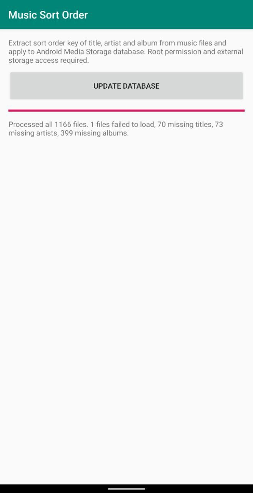
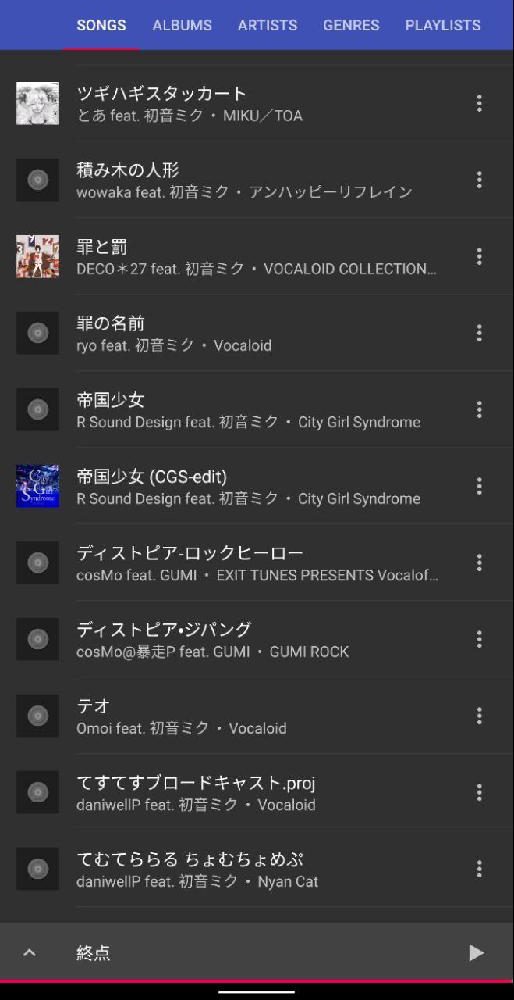

# Music Sort Order

A proof-of-concept app to add support of custom sort
order of title/artists/album names to rooted Android
devices.

|  |  |
|-|-|
| App screenshot | Demo of outcome (in Phonograph app) |

This is built with [`jaudiotagger-android`](https://github.com/hexise/jaudiotagger-android), which
is a fork of [`jaudiotagger`](http://www.jthink.net/jaudiotagger/) and supports ID3v2, MP4 tags,
Vorbis Comments (OGG, FLAC) and WMA tags.

For example, with ID3v2 tags, `TSOT`, `TSOA` and `TSOP` are inspected.

This app works by checking each music file in the Android media storage database,
and update respective values (`title_key`, `album_key`, `artist_key`) with that extracted from the
music file using root permission.

## Note
This app was initially designed as an Xposed hook, but later changed to the root strategy. You
might see the app as Xposed Module installed, but currently it does nothing useful and you can
simply ignore the Xposed part.

